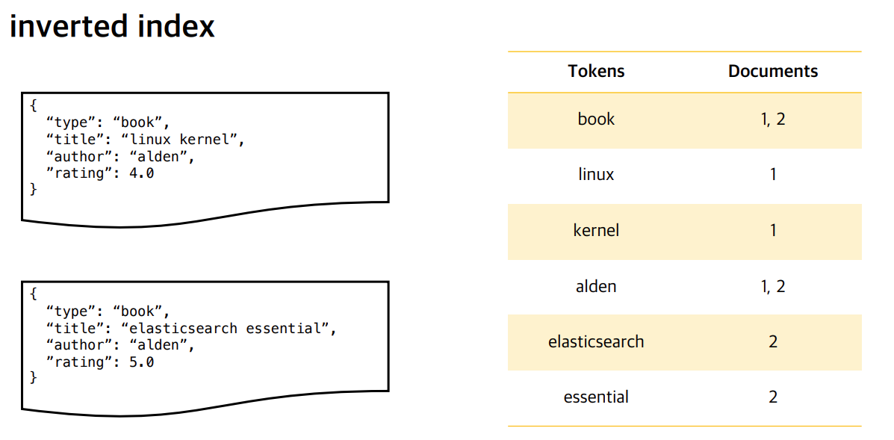
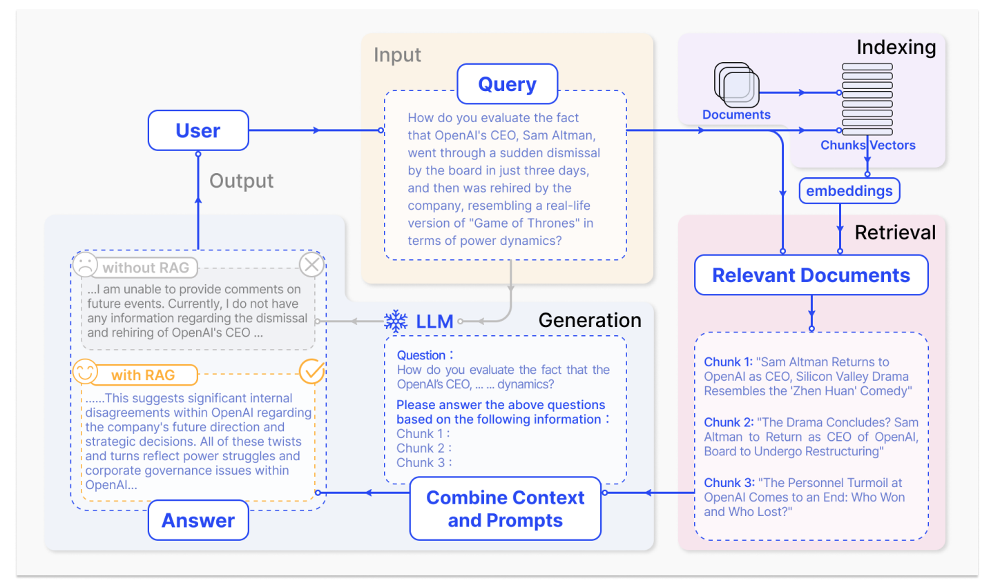
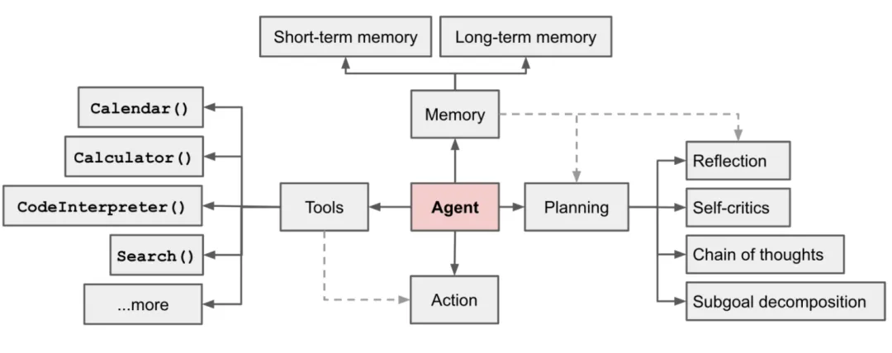

# 知识库与自动推理

## 专业名词介绍
- 全文检索与倒排索引

文本检索是一个多步骤的过程，其核心是构建倒排索引以实现高效的文本检索：

步骤一（文本预处理）：在文本预处理阶段，对原始文本进行清理和规范化，包括去除停用词、标点符号等噪声，并将文本统一转为小写。接着，采用词干化或词形还原等技术，将单词转换为基本形式，以减少词汇的多样性，为后续建立索引做准备。

步骤2（文本索引）：构建倒排索引是文本检索的关键步骤。通过对文档集合进行分词，得到每个文档的词项列表，并为每个词项构建倒排列表，记录包含该词项的文档及其位置信息。这种结构使得在查询时能够快速找到包含查询词的文档，为后续的文本检索奠定了基础。

步骤3（文本检索）：接下来是查询处理阶段，用户查询经过预处理后，与建立的倒排索引进行匹配。计算查询中每个词项的权重，并利用检索算法（如TFIDF或BM25）对文档进行排序，将相关性较高的文档排在前面。

反向索引（Inverted Index）是信息检索领域中一种核心的数据结构，它就像一本书的词语-页码索引。想象一下，你有一本书，你想快速找到所有提到某个词的页面。传统的阅读方式是逐页翻阅，效率很低。而书后的索引会告诉你每个词出现在哪些页面，让你能迅速定位。反向索引在数字世界中扮演的就是这个角色。



反向索引的核心思想是从文档到词语的映射，转变为从词语到文档的映射。反向索引的构建过程大致如下：

文档预处理： 首先，系统会对原始文档进行处理，比如分词（把连续的文本切分成一个个独立的词语或短语），标准化（比如把所有字母转成小写，去除标点符号等），以及去除停用词（移除像“的”、“是”、“和”这类意义不大的常用词）。

构建倒排列表： 对于每个处理后的词语，系统会记录它出现在哪些文档中，以及在这些文档中的具体位置信息（比如行号、词语在文档中的偏移量等）。这个记录就是倒排列表。

反向索引之所以被广泛应用于搜索引擎、数据库和各种检索系统中，是因为它提供了以下关键优势：

高效检索： 当用户输入查询词时，系统可以直接通过反向索引找到包含这些词的所有文档，而无需扫描所有文档。这大大加快了检索速度。

支持复杂查询： 它可以轻松支持“与”、“或”、“非”等布尔逻辑查询。例如，要查找同时包含“人工智能”和“应用”的文档，系统只需找到这两个词的倒排列表，然后取它们的交集即可。

排名优化： 结合TF-IDF、BM25等算法，反向索引还能帮助评估文档与查询的相关性，从而对搜索结果进行排序，把最相关的文档展示给用户。

- 全文检索与语义检索

语义检索是通过词嵌入和句子嵌入等技术，将文本表示为语义丰富的向量。通过相似度计算和结果排序找到最相关的文档。用户查询经过自然语言处理处理，最终系统返回经过排序的相关文档，提供用户友好的信息展示。语义检索通过深度学习和自然语言处理技术，使得系统能够更准确地理解用户查询，提高检索的准确性和效果。

|    | 全文检索 | 语义检索     |
|--------|------|----------|
| 定义   | 过关键词或短语匹配文本数据的过程   | 强调理解查询与文本之间的深层语义关系   |
| 方法   | 基于关键词匹配，使用TFIDF、BM25等权重计算   | 使用NLP技术，如词嵌入、预训练的语言模型   |
| 特点   | 强调字面意义，关注表面文本的匹配   | 关注词语之间的关联、语境和含义 |
| 应用场景   | 大规模文本数据的快速匹配   | 对语义理解要求较高的场景 |
| 优势   | 处理速度较快，适用于大规模文本数据   | 能够处理一词多义、近义词等语义上的复杂情况 |
| 联系  | 结合使用，先使用文本检索筛选出候选文档，然后在这些文档上应用语义检索 | 可以利用语义模型提取关键词的上下文信息，提升检索效果 |

在一些场景中，文本检索和语义检索可以结合使用，以充分利用它们各自的优势。例如，可以先使用文本检索筛选出候选文档，然后在这些文档上应用语义检索来进一步提高检索的准确性。当然具体使用哪种检索方法，需要具体分析，在RAG中可以结合两种方法一起进行使用。

-  RAG



RAG框架的最终输出被设计为一种协同工作模式，将检索到的知识融合到大型语言模型的生成过程中。在应对任务特定问题时，RAG会生成一段标准化的句子，引导大模型进行回答。下面是RAG输出到大型语言模型的典型模板：

> 你是一个{task}方面的专家，请结合给定的资料，并回答最终的问题。请如实回答，如果问题在资料中找不到答案，请回答不知道。
>
> 问题：{question}
>
> 资料：
>
> • {information1}
>
> • {information2}
>
> • {information3}
>
> 其中，{task}代表任务的领域或主题，{question}是最终要回答的问题，而{information1}、{information2}等则是提供给模型的外部知识库中的具体信息。

在更新大型语言模型的知识方面，微调模型和使用RAG这两种方法有着各自的优缺点。微调模型优势在于能够通过有监督学习的方式，通过对任务相关数据的反复迭代调整，使得模型更好地适应特定领域的知识和要求。RAG能够从外部知识库中检索最新、准确的信息，从而提高了答案的质量和时效性。其优势在于可以利用最新的外部信息，从而更好地适应当前事件和知识。

| |微调模型 |RAG|
| - | - | - |
|优点|针对特定任务调整预训练模型。优点是可针对特定任务优化；|结合检索系统和生成模型。优点是能利用最新信息，提高答案质量，具有更好的可解释性和适应性：|
| 缺点|但缺点是更新成本高，对新信息适应性较差； | 是可能面临检索质量问题和曾加额外计算资源需求;|

|特性|RAG技术|SFT模型微调|
| -| -|-|
|知识更新|实时更新检索库，适合动态数据，无需频繁重训|存储静态信息，更新知识需要重新训练|
|外部知识|高效利用外部资源，适合各类数据库|可对齐外部知识，但对动态数据源不够灵活|
|数据处理|数据处理需求低|需构建高质量数据集，数据限制可能影响性能|
|模型定制化|专注于信息检索和整合，定制化程度低|可定制行为，风格及领域知识|
|可解释性|答案可追溯，解释性高|解释性相对低|
|计算资源|需要支持检索的计算资源，维护外部数据源|需要训练数据集和微调资源|
|延迟要求|数据检索可能增加延迟|微调后的模型反应更快|
|减少幻觉|基于实际数据，幻觉减少|通过特定域训练可减少幻觉，但仍然有限|
|道德和隐私|处理外部文本数据时需要考虑隐私和道德问题|训练数据的敏感内容可能引发隐私问题|

- TFIDF和BM25

TFIDF（Term Frequency-Inverse Document Frequency）是一种用于信息检索和文本挖掘的常用权重计算方法，旨在衡量一个词项对于一个文档集合中某个文档的重要性。该方法结合了两个方面的信息：词项在文档中的频率（TF）和在整个文档集合中的逆文档频率（IDF）。

$$
TF(t, d) = \frac{\text{词项 } t \text{ 在文档 } d \text{ 中出现的次数}}{\text{文档 } d \text{ 中所有词项的总数}}
$$

其中，t表示词项，d表示文档。TF表示了一个词项在文档中的相对频率，即在文档中出现的次数相对于文档总词项数的比例。

$$
IDF(t) = \log\left(\frac{ \text{文档集合中的文档总数} }{\text{包含词项 } t \text{ 的文档数}}\right)
$$

其中，t表示词项。IDF表示了一个词项在整个文档集合中的稀有程度，如果词项在许多文档中都出现，其IDF值较低，反之则较高。

$$
TFIDF(t, d, D) = TF(t, d) \times IDF(t)
$$

其中，D表示文档集合。TFIDF的最终值是将词项在文档中的频率和在整个文档集合中的逆文档频率相乘，这样可以得到一个更全面的评估，既考虑了在文档中的重要性，也考虑了在整个文档集合中的稀有性。

BM25Okapi是BM25算法的一种变体，它在信息检索中用于评估文档与查询之间的相关性。BM25Okapi的主要参数包括：

k1：控制词项频率对分数的影响，通常设置为1.5。

bb：控制文档长度对分数的影响，通常设置为0.75。

epsilon：用于防止逆文档频率（IDF）为负值的情况，通常设置为0.25。

文档长度对分数的影响通过 b 控制。文档长度越长，该项的分数越小。BM25Okapi的打分公式综合考虑了以上三个因素，通过对每个词项的打分求和得到最终的文档与查询的相关性分数。

$$
score = \sum_{q \in query} \left( IDF(q) \cdot \frac{qfreq \cdot (k1 + 1)}{qfreq + k1 \cdot (1 - b + b \cdot \frac{doc}{avgdl})} \right)
$$

其中，avgdl是文档集合中的平均文档长度。BM25Okapi通过合理调整参数，兼顾了词项频率、文档长度和逆文档频率，使得在信息检索任务中能够更准确地评估文档与查询之间的相关性，提高检索效果

- 知识图谱问题

与标准RAG模型不同，GraphRAG擅长识别不同信息片段之间的联系并从中提取见解。这使其成为需要从大型数据集或难以总结的文档中提取见解的用户的理想选择。


```
• 索引阶段
    ◦ 文本分块：将源文本分割成可管理的块。
    ◦ 元素提取：使用LLMs识别实体和关系。
    ◦ 图构建：从提取的元素构建图。
        ▪ 实体消歧、实体合并
    ◦ 社区检测：应用Leiden等算法查找社区。
    ◦ 社区摘要：为每个社区创建摘要。
• 查询阶段
    ◦ 本地答案生成：使用社区摘要生成初步答案。
    ◦ 全局答案综合：结合本地答案形成全面响应。
```


- A*算法

A* 算法（发音为 "A-star"）是一种广泛应用于路径查找和图遍历的计算机算法。它以其效率和准确性而闻名，能够在大量可能的路径中找到最优（通常是最短）路径。你可以把它想象成一个智能的寻路者，它不仅知道要去哪里，还会根据已知的信息估算到达目的地的最佳方式。

此外如果启发式函数是可接受的，A* 算法保证能找到最优路径（通常是最短路径）。相较于其他一些图搜索算法（如广度优先搜索或深度优先搜索），A* 算法通常更高效，因为它会智能地引导搜索方向。

- 大模型与Agent



Agent包含多个部分，分别是规划（Planning）、记忆（Memory）、工具（Tools）、动作（Action）等

规划（Planning）：主要包括子目标分解、反思与改进。其中子目标分解主要指的是Agent可以将大型任务分解为较小，可管理的子目标，从而有效地处理复杂的任务；而反思和改进指的是Agent可以对过去的行动进行自我批评和自我反思，从错误中学习并改进未来的步骤，从而提高最终结果的质量。

记忆（Memory）：分为短期记忆和长期记忆。其中短期记忆是指的将所有的上下文学习（比如Prompt Engineering、In-Context Learning）都看成是利用模型的短期记忆来学习；而长期记忆为Agent提供了长期存储和召回信息的能力，它们通常通过利用外部的向量存储和快速检索来存储和召回信息。

工具（Tools）：Agent通过学会调用外部API来获取模型权重（通常在预训练后很难修改）中缺少的额外信息，包括当前信息，代码执行能力，访问专有信息源等。

动作（Action）：根据上述的规划、记忆、工具，大模型才能决策出最终需要执行的动作是什么。


## 学习指南链接

https://arxiv.org/pdf/2506.05690
When to use Graphs in RAG: A Comprehensive Analysis for Graph Retrieval-Augmented Generation

https://arxiv.org/pdf/2506.13782
XGraphRAG: Interactive Visual Analysis for Graph-based Retrieval-Augmented Generation