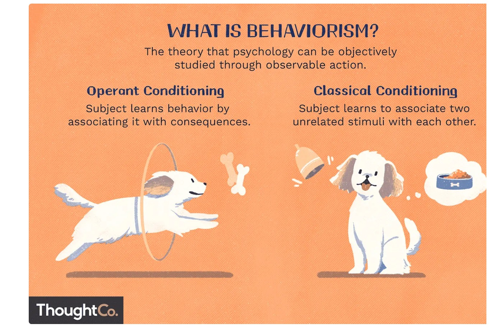
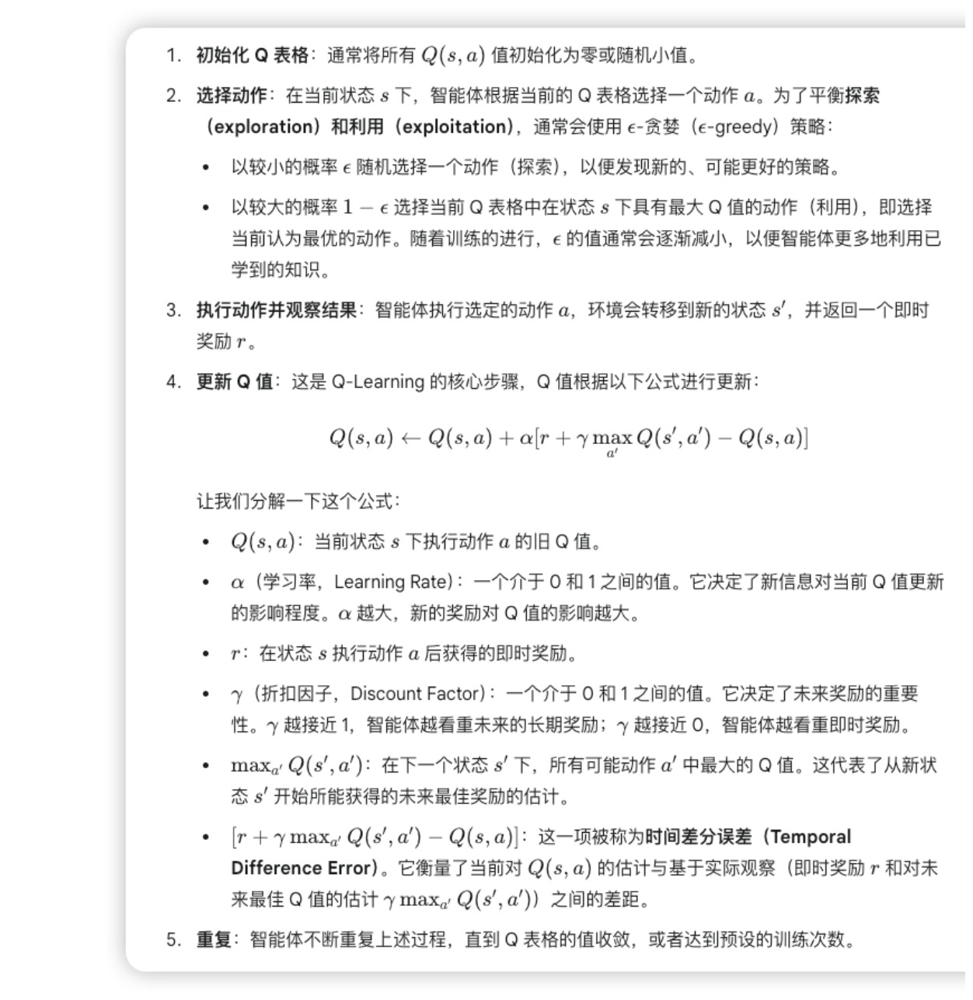
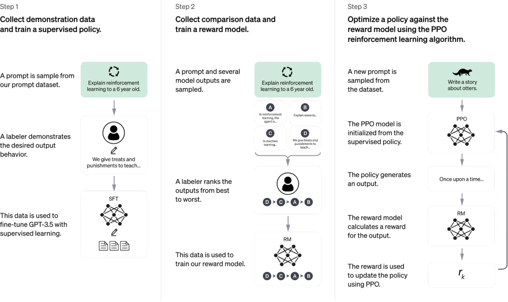
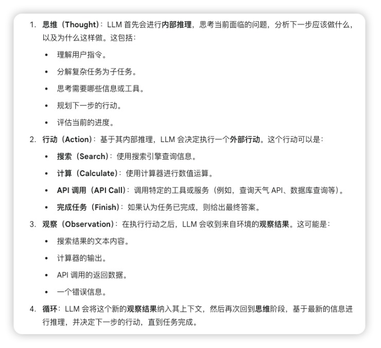
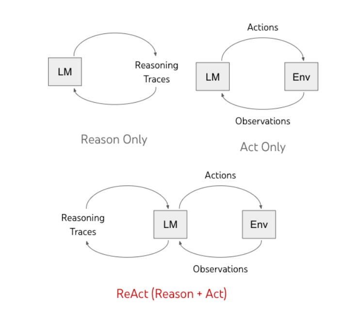

 # 第四周：行为主义 控制论与强化学习基础
 
## 专有名词介绍
- 行为主义

  在人工智能（AI）中，**行为主义**（Behaviorism）是一种看待智能系统的方法，它主要关注**可观察的行为和输入-输出关系**，而不是内部心理状态或认知过程。这种方法论受到心理学中行为主义流派的启发。

  

  简单来说，行为主义AI认为，一个智能体的智能体现在它如何对环境中的刺激做出响应，以及这些响应如何通过学习和经验得到修正。它不试图理解智能体“思考”了什么，或者它内部的“信念”、“欲望”或“意图”是什么。相反，它更侧重于构建能够通过与环境互动来学习和适应的系统。

- 强化学习

  强化学习（Reinforcement Learning, RL）是人工智能（AI）领域的一种学习方法，它让一个智能体（agent）通过与环境的持续互动来学习如何做出最佳决策，以实现特定目标。它不像监督学习那样需要带有正确答案的明确标签数据，也不像无监督学习那样寻找数据中的隐藏结构。相反，强化学习的核心在于试错和奖励机制。

  - 智能体（Agent）：这是学习者或决策者，它能够执行动作并观察环境。
  - 环境（Environment）：这是智能体所处的外部世界，它接收智能体的动作，并返回新的状态和奖励。
  - 状态（State）：环境在某一时刻的描述，智能体根据当前状态来决定下一步动作。
  - 动作（Action）：智能体在特定状态下可以执行的操作。
  - 奖励（Reward）：环境对智能体执行某个动作后给出的反馈信号。奖励可以是正的（鼓励），也可以是负的（惩罚）。智能体的目标是最大化它在长期内获得的累积奖励。
  - 策略（Policy）：这是智能体的大脑，它定义了在给定状态下应该采取什么动作的规则。智能体通过学习来优化这个策略。
  - 价值函数（Value Function）：衡量在某个状态下，遵循特定策略能获得多少累积奖励的预期。它帮助智能体评估不同状态或动作的“好坏”。
- Q-Learning
  
  Q-Learning 的核心是学习一个 Q 函数（或 Q 值），通常表示为 Q(s,a)。这个 Q 值代表了在状态 s 下采取动作 a 之后所能获得的未来累积奖励的期望值。

  
  Q-Learning 算法通常通过维护一个 Q 表格（Q-table）来实现，这是一个二维表格，行代表所有可能的状态 (s)，列代表所有可能的动作 (a)。表格中的每个单元格 Q(s,a) 存储着在状态 s 下执行动作 a 的预期未来奖励。

- DQN

  DQN 的核心思想是使用一个深度神经网络来近似 Q 函数，而不是使用一个表格。这个神经网络被称为 Q 网络。
  - 输入：Q 网络的输入是当前环境的状态（例如，游戏的屏幕像素）。
  - 输出：Q 网络的输出是每个可能动作对应的 Q 值。
- GPT与强化学习
  
  为了让 GPT 模型更“聪明”、更“听话”、更“安全”，OpenAI 引入了人类反馈强化学习（Reinforcement Learning from Human Feedback, RLHF）。这是 GPT 模型从纯粹的文本生成器转变为实用对话 AI 的关键步骤，例如 ChatGPT 的诞生就大量受益于 RLHF。
  

  - 监督微调 (Supervised Fine-tuning, SFT)：
    - 首先，使用一小部分高质量的人工编写的对话数据对预训练的 GPT 模型进行微调。这些数据包括人类编写的指令和模型应有的理想回应。
    - 这一步的目的是让模型初步学习如何遵循指令并产生有用、无害的回答。模型开始从通用的“预测下一个词”转变为“按照指令生成回应”。
  - 训练奖励模型 (Reward Model, RM)：
    - 对于一系列给定的提示，让经过 SFT 的模型生成多个不同的回应。
    - 然后，人类标注员会对这些回应进行质量排序（例如，哪个回应更好、更相关、更安全等）。
    - 这些人类偏好数据被用来训练一个单独的奖励模型。这个奖励模型的任务是：给定一个提示和一个回应，它能输出一个标量值（奖励分数），来量化这个回应在人类看来有多好。本质上，奖励模型学习了人类的偏好。
  - 使用强化学习微调语言模型 (RL Fine-tuning)：
    - 将预训练和 SFT 后的 GPT 模型视为一个强化学习智能体。
    - 环境：接收提示，并生成回应。
    - 状态：当前对话的上下文和智能体需要生成下一个词的提示。
    - 动作：生成下一个词（token）。
    - 奖励函数：由之前训练好的奖励模型提供。当智能体（GPT 模型）生成一个完整的回应后，奖励模型会评估这个回应，并给出一个奖励分数。
    - 使用强化学习算法（例如，PPO - Proximal Policy Optimization，一种基于策略梯度的强化学习算法）来优化 GPT 模型的参数。目标是让 GPT 模型学习到一个策略，使其能够生成那些能获得奖励模型高分的回应。
  
- ReAct智能体

  ReAct 的名字 "ReAct" 就来源于其两个关键组成部分：Reasoning (推理) 和 Acting (行动)。它模仿了人类解决问题的过程，通过内部思考和外部操作的结合来完成任务。
      

## 学习资料链接
基础RL：https://github.com/FareedKhan-dev/all-rl-algorithms/blob/master/1_simple_rl.ipynb
Q-learning：https://github.com/FareedKhan-dev/all-rl-algorithms/blob/master/2_q_learning.ipynb
DQN：https://github.com/FareedKhan-dev/all-rl-algorithms/blob/master/13_dqn.ipynb
RLHF：https://github.com/ash80/RLHF_in_notebooks