# 第5周：AI算法进阶

## 专业名词介绍

- 推荐系统

  推荐系统就像你的一个“贴心导购”或“私人DJ”。它的目标是根据你的历史行为、偏好以及与你相似的人的喜好，从海量的商品、内容或信息中，为你筛选出最可能感兴趣、最符合你需求的那一部分。它能大大减少你寻找信息的时间，提升你的体验。从专业的角度看，推荐系统是利用数据科学、机器学习和人工智能技术，构建个性化信息过滤和推荐的引擎。它的核心在于预测用户对某个物品（item）的兴趣程度。
  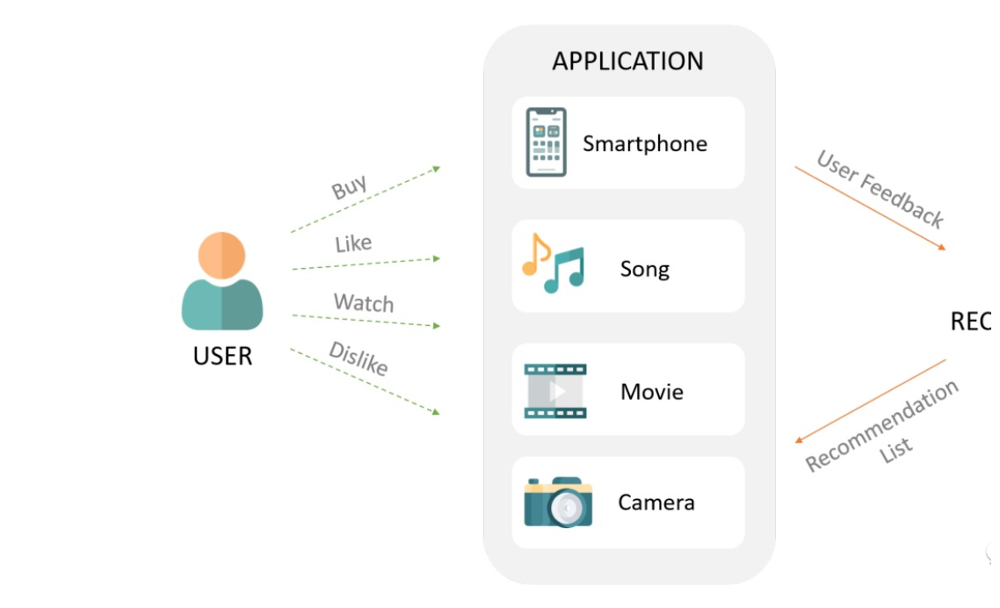

  目前主流的推荐系统方法主要有以下几类:
  - 协同过滤 (Collaborative Filtering)：这是推荐系统中最经典、最常用的一类方法。它的基本思想是“物以类聚，人以群分”。
    - 基于用户的协同过滤 (User-based CF)：如果你喜欢和A、B、C三个人看一样的电影，而A、B、C都喜欢D电影，那么系统就会向你推荐D电影。
    - 基于物品的协同过滤 (Item-based CF)：如果你看了某部电影，系统会找出与这部电影相似的其他电影推荐给你（比如同样是科幻片，或同样由某个导演执导）。
    - 优点：不需要物品的元数据，只依赖用户行为数据就能进行推荐。
    - 缺点：存在“冷启动问题”（新用户或新物品没有足够的行为数据），并且在高维稀疏数据下性能可能下降。
  - 基于内容的推荐 (Content-based Recommendation)：这种方法关注物品自身的特征属性。例如，如果你喜欢看科幻电影，那么系统会根据电影的“类型”标签，向你推荐更多科幻电影。
    - 优点：能够很好地解决冷启动问题，因为即使是新物品，只要有足够的特征描述，也能被推荐。
    - 缺点：推荐结果可能不够惊喜，容易陷入“信息茧房”，即只推荐用户已经喜欢的内容。
  - 混合推荐 (Hybrid Recommendation)：为了扬长避短，大多数现代推荐系统都会将上述多种方法结合起来，形成混合推荐模型。例如，将协同过滤和基于内容的推荐结合，既能提供个性化惊喜，又能处理冷启动问题。
  - 深度学习推荐 (Deep Learning-based Recommendation)：随着深度学习技术的兴起，越来越多的推荐系统开始采用神经网络模型。深度学习能够更好地捕捉用户行为和物品特征之间复杂的非线性关系，提升推荐的精准度和多样性。例如，通过学习用户的点击、购买序列，预测用户下一步可能感兴趣的商品。
- CTR

  点击率（Click-Through Rate，简称 CTR）是衡量数字营销效果的一个关键指标，尤其在在线广告、搜索引擎优化（SEO）和推荐系统中非常重要。它简单直接地反映了你的内容、广告或链接对用户的吸引力。
  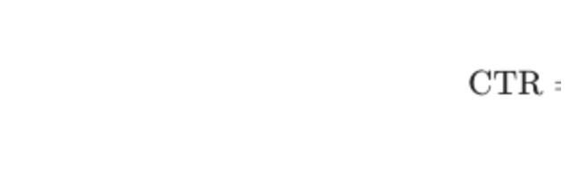
  点击率预估（Click-Through Rate Prediction，简称 CTR 预估）是人工智能，特别是机器学习领域的一个核心任务。它的目标是预测用户在特定情境下，点击某个推荐项目（如广告、商品、新闻等）的可能性或概率。简单来说，就是预估“这个用户有多大概率会点击这个内容？”
- 协同过滤
  
  协同过滤 (Collaborative Filtering, CF) 是一种非常经典且应用广泛的技术。它的核心思想是利用用户的历史行为数据，通过分析用户或物品之间的相似性，来预测用户可能感兴趣的内容并进行推荐。简单来说，就是基于“物以类聚，人以群分”的原则。
  - 基于用户的协同过滤 (User-based Collaborative Filtering, User-CF)
    
    找到与目标用户兴趣相似的其他用户（“邻居”），然后将这些邻居用户喜欢但目标用户尚未接触过的物品推荐给目标用户。
  - 基于物品的协同过滤 (Item-based Collaborative Filtering, Item-CF)
    
    找到与目标用户已喜欢物品相似的其他物品，然后将这些相似物品推荐给目标用户。
  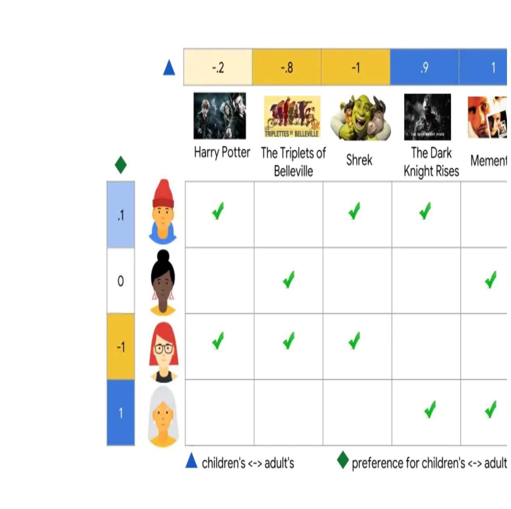
- 逻辑回归 LR

  https://scikit-learn.org/stable/modules/generated/sklearn.linear_model.LogisticRegression.html#sklearn.linear_model.LogisticRegression

  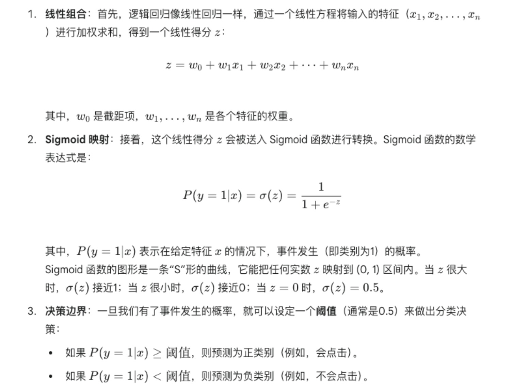
- GBDT

  https://scikit-learn.org/stable/modules/generated/sklearn.ensemble.GradientBoostingClassifier.html
  梯度提升决策树（Gradient Boosting Decision Tree，简称 GBDT）是一种强大的集成学习（Ensemble Learning）算法。它通过串行地构建一系列弱学习器（通常是决策树），并将它们的结果累加起来，GBDT 借鉴了梯度下降的思想。在每一步迭代中，它不是直接拟合上一个模型的残差（预测值与真实值之间的差异），而是拟合损失函数（Loss Function）的负梯度。
  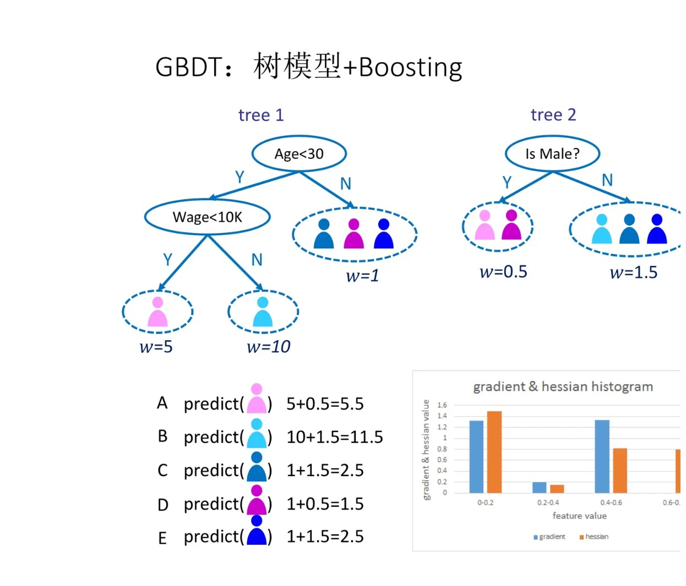
  
- 业务特征与交叉特征
  
  交叉特征（Cross Features） 是指将两个或多个原始特征或业务特征进行组合（交叉）而形成的新特征。它们旨在捕捉不同特征之间的交互作用或非线性关系，这种关系是单一特征无法表达的。
  - 用户地区 x 商品类别： 例如，北京用户 & 服装类。这可以捕捉到不同地区用户对不同商品类别的独特偏好。比如，“上海用户对奢侈品箱包的点击率”可能远高于“内蒙用户对奢侈品箱包的点击率”。
  - 性别 x 年龄段 x 商品品牌： 例如，女性 & 20-30岁 & 某化妆品品牌。
  - 用户ID x 广告ID： 这是个性化推荐中最直接的交叉，它直接对应了特定用户对特定广告的兴趣。
  - 广告曝光时长 x 广告位置得分： 可能会更好地反映广告的有效性。
  - 价格 x 折扣率： 生成一个“实际售价”的交叉特征。
- 全链接网络

  全连接网络（Fully Connected Network），也常被称为多层感知机（Multi-Layer Perceptron，MLP），是深度学习中最基础也是最核心的神经网络结构之一。它的特点是网络中的每一层神经元都与前一层的所有神经元完全连接。
  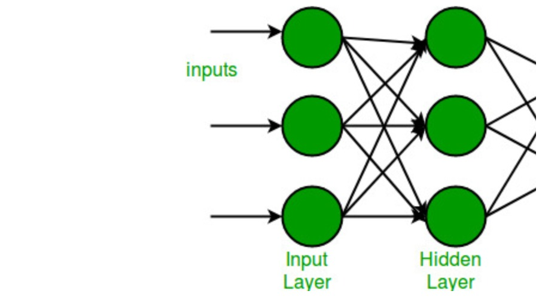
  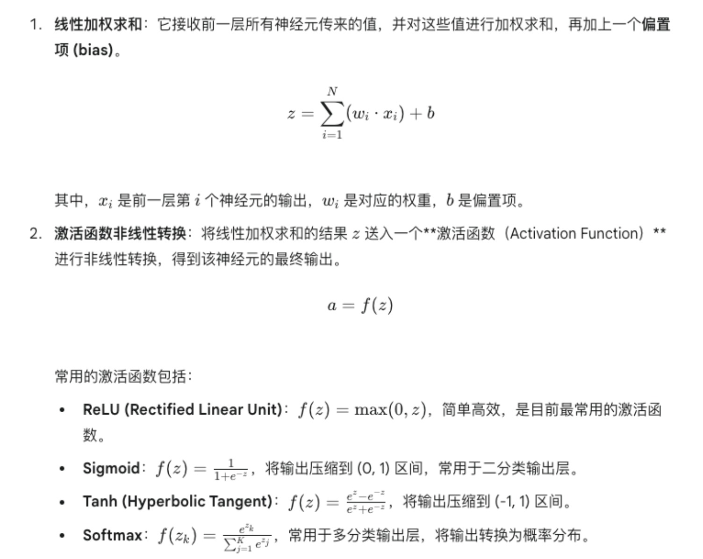
  
- 深度学习优化过程
  
  损失函数是衡量模型预测结果与真实值之间差异大小的度量。它的值越小，表示模型的预测越准确；值越大，表示误差越大。优化过程的目标就是最小化损失函数。反向传播是计算损失函数关于模型所有参数梯度的核心算法。它将误差从输出层反向传播到网络的每一层，计算每个参数对误差的贡献，从而为优化器提供参数更新的依据。学习率是优化器在每次迭代中调整参数的步长大小。它是优化过程中最关键的超参数之一。
  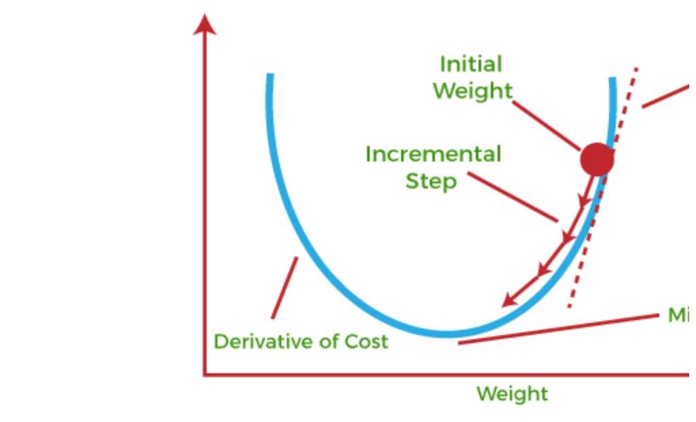

  - 数据准备：将数据集分成训练集、验证集和测试集。
  - 模型构建：定义神经网络的结构（层数、每层神经元数量、激活函数等）。
  - 损失函数选择：根据任务类型（回归/分类）选择合适的损失函数。
  - 优化器选择：选择合适的优化器（如 Adam）。
  - 训练循环：
  - Epoch：遍历整个训练数据集的次数。
  - Batch：每次迭代时，从训练集中随机抽取一小批数据进行训练。
    - 前向传播：将 Batch 数据输入模型，得到预测结果。
    - 计算损失：根据预测结果和真实标签，计算 Batch 的损失值。
    - 反向传播：计算损失函数对所有模型参数的梯度。
    - 参数更新：优化器根据梯度和学习率更新模型参数。

  
- Embedding 层

  Embedding 层（嵌入层） 是一种非常常见且重要的神经网络层，它主要用于将离散型（或类别型）的输入数据，转换成一种低维、连续的向量表示。这个过程就叫做嵌入（Embedding）。Embedding 层本质上是一个可学习的查找表（Look-up Table）。它将每个离散的输入值（通常是整数ID）映射到一个固定维度的实数向量。
  https://docs.pytorch.org/docs/stable/generated/torch.nn.Embedding.html#torch.nn.Embedding

- Wide & Deep
  Wide & Deep 模型 是 Google 于 2016 年 提出的，用于解决推荐系统领域中记忆（Memorization）和泛化（Generalization） 之间的矛盾。它巧妙地将一个线性模型（Wide 部分）和一个深度神经网络（Deep 部分）结合起来，从而在推荐、广告点击率预估等任务中取得了显著的效果。
  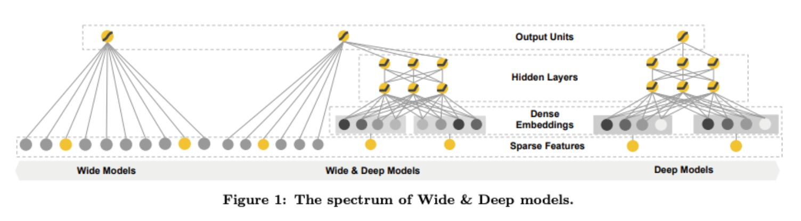

  - Wide 部分（记忆）：通常是一个广义线性模型，如逻辑回归 (Logistic Regression)。
    - 原始特征 (Raw Features)：主要是类别型特征的 One-Hot 编码（例如，用户 ID、物品 ID）。
    - 交叉特征 (Cross-product Features)：人工构建的特征组合，通常是两个或多个离散特征的笛卡尔积。例如，“用户安装的 APP 类别”与“广告 APP 类别”的交叉，AND(installed_category=sport, impression_category=game)。这种特征能够捕捉到一些强烈的共现关系。
  - Deep 部分（泛化）
    - 连续特征 (Continuous Features)：原始的数值型特征（例如，年龄、商品价格）。
    - 类别特征的 Embedding 向量：将离散型特征（如用户 ID、物品 ID、性别、职业等）通过Embedding 层转换为低维、稠密的实数向量。这些 Embedding 向量会作为 Deep 部分的输入。

  Wide 部分和 Deep 部分的输出会被连接起来，经过一个最终的 Sigmoid 层（对于二分类问题）或 Softmax 层（对于多分类问题）进行预测。整个模型通过反向传播和梯度下降（通常是 Adam 或 Adagrad 等优化器）进行端到端（End-to-End）的联合训练。这意味着 Wide 和 Deep 两部分的权重会同时被优化，共同服务于最小化总损失。

  
- FM和DeepFM

  FM 的核心思想是：给每个特征学习一个低维的“隐性特征向量”（或称“嵌入向量”）。当我们需要考虑两个特征的交互作用时，就用它们的隐性特征向量的点积来表示这种交互。
  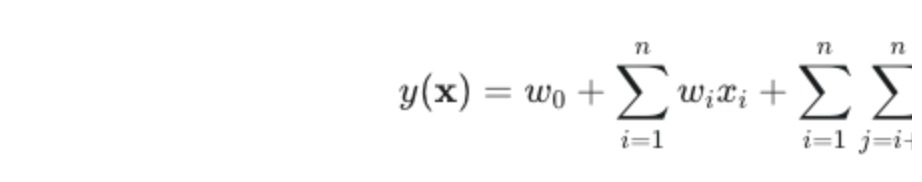

  DeepFM 把 Wide & Deep 中的 Wide 部分替换成了 FM 模型，同时保留了 Deep 部分（深度神经网络）。FM 部分和 Deep 部分共享同一个 Embedding 层。这意味着，那些用来表示每个特征的隐性向量（Embedding）是两部分共用的，它们会一起学习和优化。
  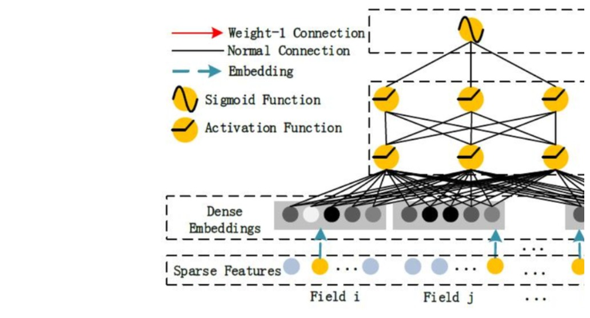
- 表示学习与深度学习网络设计
  
  表示学习就是这个“组合”和“赋义”的过程。它让机器学习模型不再直接处理那些原始、零散、高维或难以理解的数据（比如像素点、原始文本字符、用户ID），而是通过学习，将它们转换成一种更抽象、更紧凑、更易于模型处理和理解的“有意义的概念”。这些“概念”通常表现为低维、稠密的向量。

  设计一个深度学习网络就像用不同的乐高积木（各种层和模块）来搭建一个复杂的结构。你需要考虑：
  - 用什么积木？ (选择卷积层、循环层、全连接层、注意力机制等)
  - 怎么堆叠？ (层与层之间如何连接，顺序是怎样的)
  - 每层用多少块？ (神经元数量、卷积核数量)
  - 在哪加点“胶水”让它更稳固？ (使用正则化、归一化等技术防止散架)
  - 最终想搭成什么样子？ (根据任务选择输出层和损失函数)

## 学习资料链接

Tree Embedding https://scikit-learn.org/stable/modules/generated/sklearn.ensemble.RandomTreesEmbedding.html
DeepFM https://www.kaggle.com/code/gpreda/deep-factorization-machine-movielens-20m