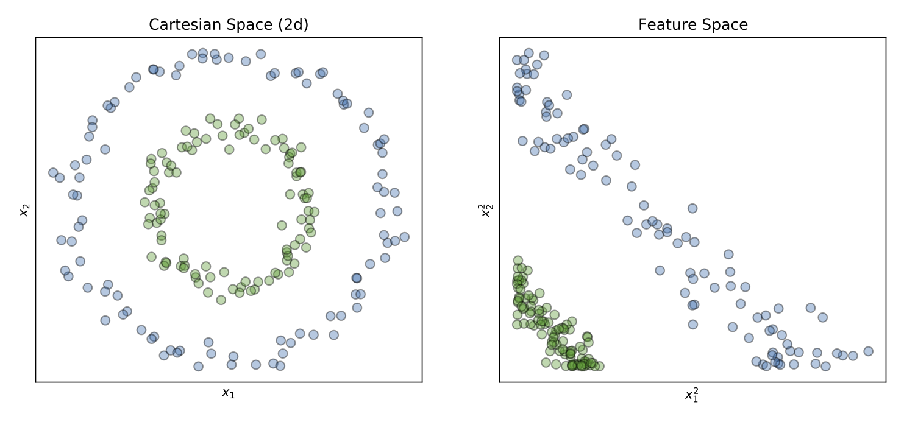
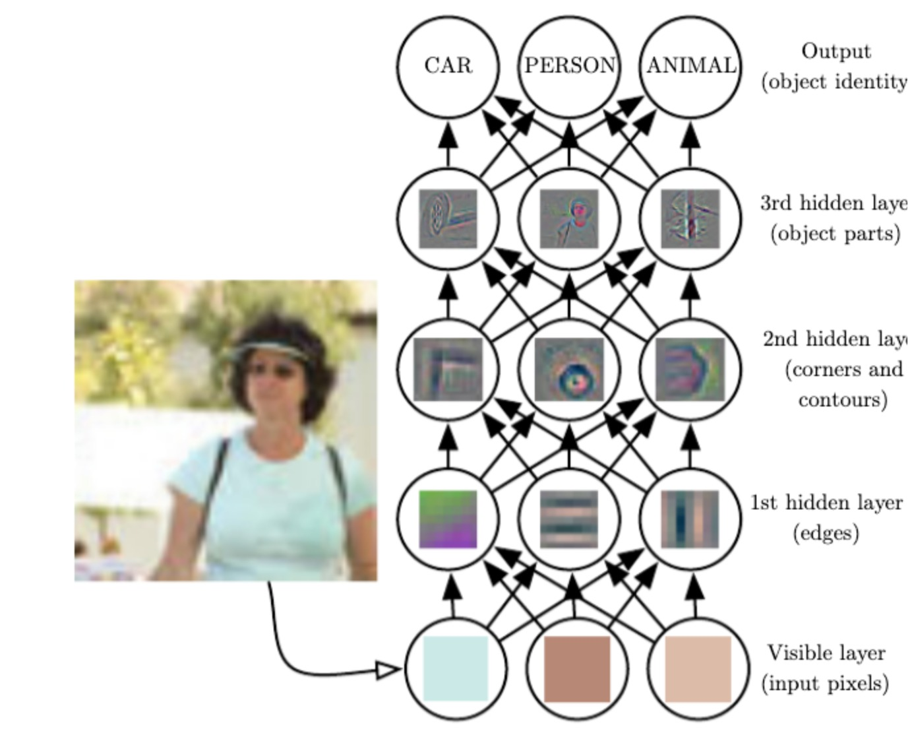
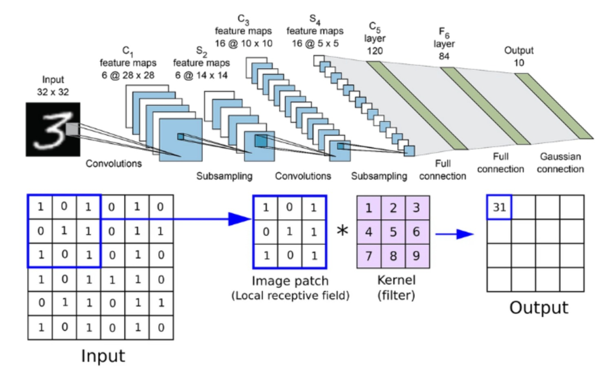
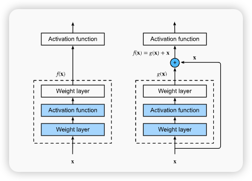
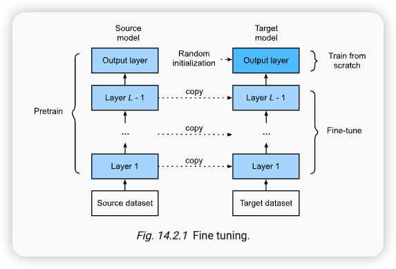
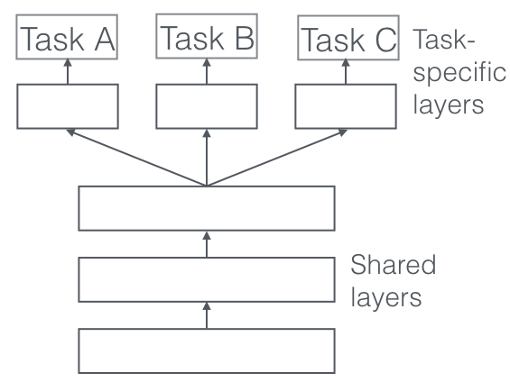
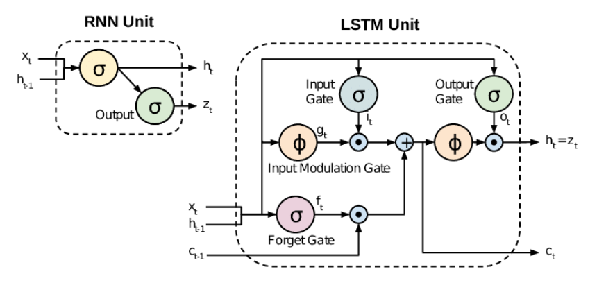

# 现代神经网络

## 专业知识介绍

- 表示学习

  表示学习（Representation Learning）是机器学习的一个重要分支，它旨在让机器自动学习到数据的一种有效“表示”或“特征”。简单来说，数据原始的形式可能不适合直接用于机器学习任务（例如，图像是像素值的矩阵，文本是字符序列）.

  

  表示学习的目标是将这些原始数据转换成一种更高级、更有意义、更有利于后续任务（如分类、聚类）的特征表示。这种表示通常是低纬的向量或举证，能更好地捕捉数据的内在结构和模式，并且可以消除原始数据中的冗余和噪声。例如，在图像识别中，表示学习可以将原始像素数据转换为更抽象的特征，如边缘、纹理或物体的局部形状。

  深度学习之所以被称为“深度”，正是因为它使用了多层神经网络。多层结构赋予了深度学习模型强大的分层特征学习能力。每一层神经网络都可以学习到不同抽象层次的特征：

  - 浅层网络： 通常学习到数据最基本、最通用的特征。例如，在图像中，第一层可以能学习到边缘和角点；在文本中，第一层可能学习到词向量或短语。
  - 深层网络：在浅层特征的基础上，逐步学习到更抽象、更复杂的特征。例如，在图像中，深层网络可以组合边缘和角点来识别出局部形状，再组合局部形状来识别出物体部件，最终识别出整个物体。在文本中，深层网络可以理解词语之间的语义关系，从而捕捉到句子的整体含义。

- 卷积神经网络

  卷积神经网络（CNN）是一种专门设计用于处理具有网状拓扑数据（如图像、视频）的深度学习模型。其核心特点是使用了卷积层（Convolutional Layer），通过卷积核（Kernel）或滤波器（Filter）在输入数据上进行滑动和点乘运算，从而提取局部特征。

  

  CNN的主要优势包括：
  - 局部感受野（Local Receptive Fields）：每个神经元只连接到输入数据的一个局部区域，这使得网络能够关注图像的局部特征。
  - 权值共享（weight Sharing）:同一个卷积核在整个输入数据上滑动，意味着提取相同特征的参数是共享的，这大大减少了模型的参数数量，降低了过拟合的风险，并提高了模型的泛化能力。
  - 池化层（Pooling Layer）：通常在卷积层之后使用，用于降低特征图的维度，减少计算量，并提供一定程度的平移不变形。

  

- ResNet和DenseNet

  ResNet(Residual Network)和DenseNet(Densely Connected Convolutiional Network)是两种在深度学习领域具有里程碑意义的卷积神经网络架构，它们都旨在解决训练极深网络时遇到的梯度消失/爆炸和退化（Degradation）问题（即网络层数增加后，训练准确率反而饱和或下降）。

  

- 迁移学习

  迁移学习是一种机器学习方法，它将从一个任务（源任务）中学习到的知识，应用到另一个相关但不同的任务（目标任务）中。档目标任务的数据量较小或难以获取大量标注数据时，迁移学习显得尤为重要。

  

  迁移学习的核心思想是：在大规模数据集上预训练一个模型（例如，在ImageNet上预训练一个CNN用于图像分类），然后将这个预训练模型的权重作为新任务的初始化，并在此基础上对模型进行微调（Fine-tuning）。这种方法可以显著提高模型的训练效率和性能，尤其是在目标任务数据稀缺的情况下。

- 多任务学习
  多任务学习是一种机器学习范式，它通过同时训练一个模型来完成多个相关任务。与独立训练每个任务的模型不同，多任务学习旨在利用任务之前的共享信息，从而提高所有任务的整体性能。
  

- RNN、LSTM
  循环神经网络（Recurrent Neural Networks，RNN）是一类专门用于处理序列数据（如时间序列、文本、语音）的神经网络。与传统神经网络不同，RNN具有“记忆”能力，它能够将之前的信息（通过隐藏状态）传递到当前时刻的计算中。这使得RNN在处理序列数据时能够捕捉到时间行的依赖关系。

  

  RNN的计算过程可以概括为：当前时刻的输出和隐藏状态不仅取决于当前时刻的输入，还取决于上一时刻的隐藏状态。然而，传统的RNN存在长期依赖问题（Long-Term Dependency Problem），即在处理长序列时，梯度会随着时间步的增加而指数级地消失或爆炸，导致模型难以学习到远距离的依赖关系。

  为了解决这个问题，长短记忆网络（Long Short-Term Memory，LSTM）被提出。LSTM是RNN的一种特殊类型，它通过引入一套复杂的“门控机制”来有效地控制信息的流动，从而解决了长期依赖问题。LSTM的内部结构包含：
  - 遗忘门：控制上一时刻的细胞状态(长期记忆)中哪些信息应该被遗忘。
  - 输入门： 控制当前时刻的输入哪些信息应该被添加到细胞状态中。
  - 输出门： 控制细胞状态中哪些信息应该被作为当前时刻的隐藏状态输出。
