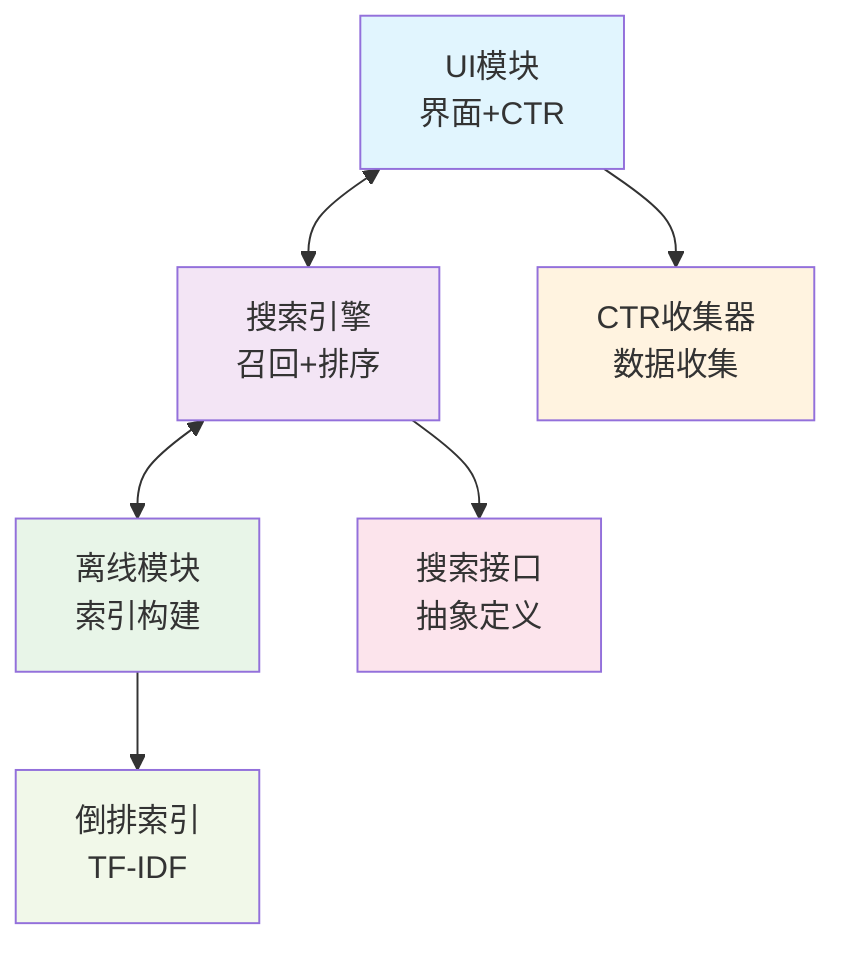
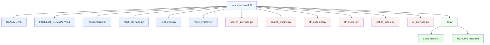
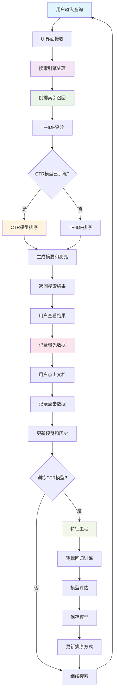

# 🔍 倒排索引检索系统 - 项目总结

## 📋 项目概述

本项目实现了一个完整的倒排索引检索系统，包含传统信息检索和现代CTR（点击率）排序功能。系统采用接口解耦的架构设计，适合教学演示和实验研究。

## 🏗️ 系统架构

### 核心设计原则
- **接口解耦**: 通过抽象接口实现模块间松耦合
- **职责分离**: UI、在线检索、离线索引各司其职
- **可扩展性**: 易于添加新的排序算法和特征
- **教学友好**: 代码结构清晰，注释详细

### 架构图

## 📁 文件结构

## 🔄 系统流程

## 🎯 核心功能

### 1. 倒排索引检索
- **中文分词**: 使用jieba进行文本预处理
- **TF-IDF计算**: 基于词频-逆文档频率的文档评分
- **两阶段检索**: Retrieve召回 + Rank排序
- **智能摘要**: 自动生成包含查询词的文档摘要
- **关键词高亮**: 搜索结果中高亮显示查询词

### 2. CTR模型训练
- **特征工程**: 9个CTR相关特征
  - 位置特征（最重要）
  - 长度特征（查询、文档、摘要）
  - 查询匹配度
  - 历史CTR（查询和文档级别）
  - 位置衰减
  - 原始相似度分数
- **模型算法**: 逻辑回归（适合CTR预测）
- **性能评估**: AUC、精确率、召回率、F1分数
- **特征权重可视化**: 直观显示特征重要性

### 3. 交互式界面
- **Gradio Web界面**: 现代化的用户界面
- **实时搜索**: 支持回车键快速搜索
- **文档预览**: 点击结果行查看完整文档
- **历史记录**: 查看所有曝光和点击历史
- **排序切换**: TF-IDF vs CTR排序模式
- **数据导出**: 导出CTR数据用于分析

### 4. 数据收集与分析
- **曝光记录**: 自动记录所有展示的文档
- **点击行为**: 记录用户的点击行为
- **位置信息**: 记录文档在结果中的位置
- **实时统计**: 提供CTR实时统计信息
- **自动保存**: CTR数据自动保存到JSON文件

## 🛠️ 技术栈

### 核心依赖
- **jieba**: 中文分词
- **numpy**: 数值计算
- **scikit-learn**: 机器学习（逻辑回归）
- **gradio**: Web界面框架
- **pandas**: 数据处理

### 设计模式
- **抽象工厂**: 接口定义和实现分离
- **策略模式**: 多种排序算法切换
- **观察者模式**: CTR数据收集
- **单例模式**: 搜索引擎实例管理

## 📊 教学价值

### 理论知识点
1. **信息检索基础**
   - 倒排索引原理
   - TF-IDF算法
   - 文档预处理
   - 查询处理

2. **机器学习应用**
   - 特征工程
   - 逻辑回归
   - 模型评估
   - CTR预测

3. **系统设计**
   - 接口设计
   - 模块解耦
   - 数据流设计
   - 用户体验

### 实践技能
1. **编程能力**
   - Python开发
   - 面向对象设计
   - 单元测试
   - 错误处理

2. **数据分析**
   - 数据收集
   - 特征提取
   - 模型训练
   - 结果分析

3. **系统集成**
   - 模块集成
   - 接口调用
   - 数据流转
   - 性能优化

## 🎓 教学场景

### 适用课程
- **信息检索**: 倒排索引、TF-IDF、文档检索
- **机器学习**: 特征工程、逻辑回归、模型评估
- **软件工程**: 系统设计、接口设计、模块化开发
- **人机交互**: 搜索界面、用户体验、交互设计

### 实验设计
1. **基础实验** (2-3小时)
   - 系统使用和功能体验
   - 数据收集和模型训练
   - 排序效果对比分析

2. **进阶实验** (4-6小时)
   - 特征工程优化
   - 新排序算法实现
   - 界面功能扩展

3. **研究实验** (8-12小时)
   - 大规模数据测试
   - 算法性能对比
   - 用户行为分析

## 📈 项目成果

### 代码质量
- **模块化设计**: 清晰的代码结构
- **接口解耦**: 易于维护和扩展
- **单元测试**: 完整的测试覆盖
- **文档完善**: 详细的说明文档

### 功能完整性
- **核心检索**: 完整的倒排索引实现
- **CTR排序**: 实用的点击率预测
- **用户界面**: 现代化的Web界面
- **数据管理**: 完善的数据收集和分析

## 🎉 总结

本项目成功实现了一个功能完整、架构清晰的倒排索引检索系统。通过接口解耦的设计，系统具有良好的可维护性。丰富的功能和完善的文档使其非常适合教学使用，能够帮助学生深入理解信息检索和机器学习的核心概念。

项目的成功不仅体现在技术实现上，更重要的是在教学价值方面。它为学生提供了一个完整的实践平台，让他们能够从理论到实践，从基础到进阶，全面掌握相关知识和技能。 