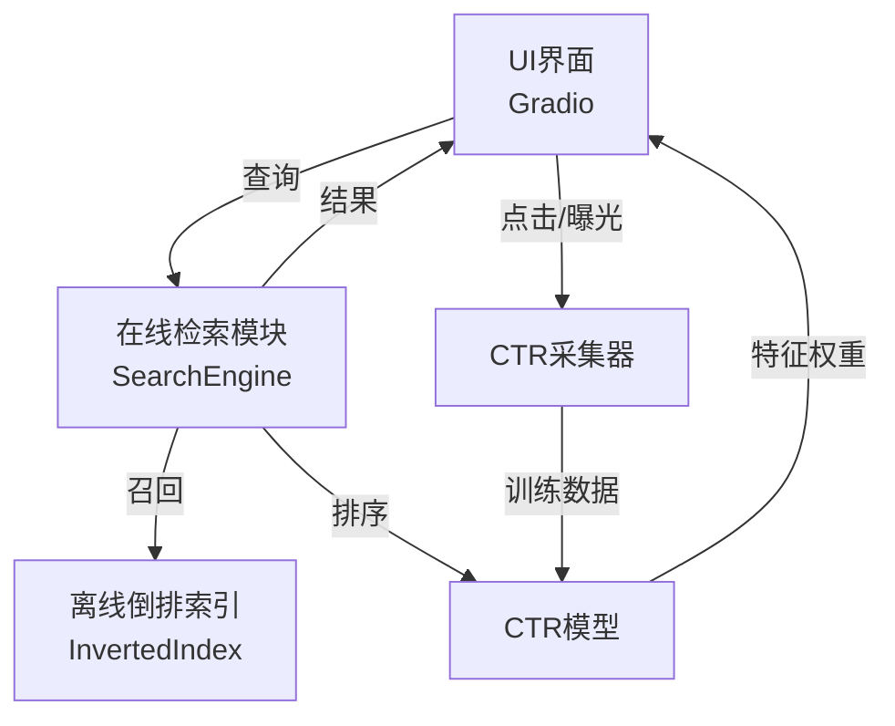
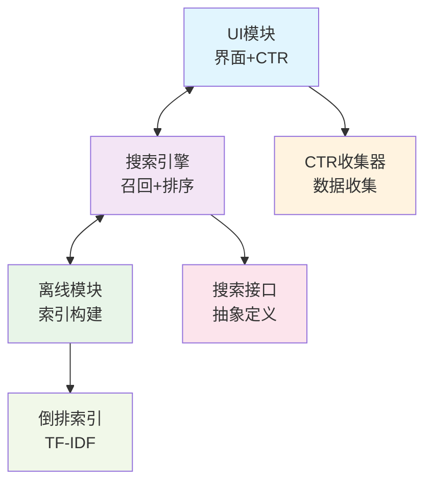
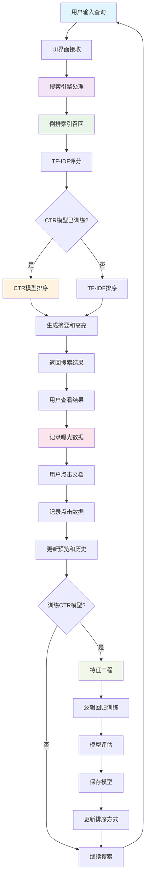

# 🔍 倒排索引检索系统



基于TF-IDF的传统信息检索系统，采用接口解耦的架构设计。

## 🏗️ 架构设计

### 接口解耦架构



### 核心组件

#### 1. **搜索接口** (`search_interface.py`)
- **职责**: 定义核心功能接口
- **功能**: 
  - `SearchInterface`: 搜索功能抽象接口
  - `CTRInterface`: CTR数据收集抽象接口

#### 2. **搜索引擎** (`search_engine.py`)
- **职责**: 实现搜索接口，负责召回+排序
- **功能**:
  - 实现 `SearchInterface`
  - 倒排索引查询
  - TF-IDF召回算法
  - CTR模型排序算法
  - 文档获取

#### 3. **CTR收集器** (`ctr_collector.py`)
- **职责**: 实现CTR接口，负责数据收集
- **功能**:
  - 实现 `CTRInterface`
  - 曝光记录
  - 点击记录
  - 数据导出

#### 4. **UI界面** (`ui_interface.py`)
- **职责**: 用户界面和组件协调
- **功能**:
  - Gradio Web界面
  - 调用搜索引擎和CTR收集器
  - 数据展示和交互
  - CTR模型训练

#### 5. **CTR模型** (`ctr_model.py`)
- **职责**: CTR模型训练和预测
- **功能**:
  - 特征工程（查询+摘要TF-IDF + 位置+分数）
  - 逻辑回归模型训练
  - CTR分数预测
  - 模型持久化

## 🚀 快速开始

### 1. 安装依赖
```bash
pip install -r requirements.txt
```

### 2. 一键启动
```bash
python start_system.py
```

### 3. 手动启动
```bash
# 1. 构建索引
python offline/offline_index.py

# 2. 启动UI界面
python ui/portal.py
```

## 🔄 系统流程



## 📋 功能特性

### 🔍 搜索功能
- **中文分词**: 使用jieba进行中文文本预处理
- **两阶段检索**: Retrieve召回 + Rank排序
- **TF-IDF召回**: 基于词频-逆文档频率的文档召回
- **CTR排序**: 使用训练好的CTR模型进行精排
- **关键词高亮**: 搜索结果中高亮显示查询词
- **智能摘要**: 自动生成包含查询词的文档摘要

### 📊 CTR数据收集与模型训练
- **曝光记录**: 自动记录所有展示的文档
- **点击行为**: 记录用户的点击行为
- **位置信息**: 记录文档在结果中的位置
- **实时统计**: 提供CTR实时统计信息
- **模型训练**: 一键训练CTR模型
- **自动排序**: 训练后自动使用CTR模型排序

### 🎯 交互功能
- **实时搜索**: 支持回车键快速搜索
- **文档预览**: 点击结果行查看完整文档
- **历史记录**: 查看所有曝光和点击历史
- **自动保存**: CTR数据自动保存到文件

## 🔧 接口设计

### 搜索接口
```python
class SearchInterface(ABC):
    @abstractmethod
    def search(self, query: str, top_k: int = 10) -> List[Tuple[str, float, str]]:
        """执行搜索"""
        pass
    
    @abstractmethod
    def get_document(self, doc_id: str) -> str:
        """获取文档内容"""
        pass
    
    @abstractmethod
    def get_stats(self) -> Dict[str, Any]:
        """获取索引统计信息"""
        pass
```

### CTR接口
```python
class CTRInterface(ABC):
    @abstractmethod
    def record_impression(self, query: str, doc_id: str, position: int, score: float, summary: str):
        """记录曝光"""
        pass
    
    @abstractmethod
    def record_click(self, query: str, doc_id: str, position: int):
        """记录点击"""
        pass
    
    @abstractmethod
    def get_history(self) -> List[Dict[str, Any]]:
        """获取历史记录"""
        pass
    
    @abstractmethod
    def export_data(self) -> Dict[str, Any]:
        """导出CTR数据"""
        pass
```

## 📈 CTR模型训练

### 1. 收集数据
在UI界面中进行搜索和点击操作，系统会自动收集CTR数据。

### 2. 训练模型
点击"训练CTR模型"按钮，系统会：
- 自动提取特征（查询+摘要TF-IDF + 位置+分数）
- 训练逻辑回归模型
- 评估模型性能（AUC、精确率、召回率、F1）
- 保存模型到文件

### 3. 自动排序
训练完成后：
- 模型自动加载到搜索引擎
- 后续搜索使用CTR分数排序
- 排序分数变为预测的点击率（0-1之间）

### 4. 模型特性
- **特征工程**: 9个CTR相关特征
  - 位置特征（最重要）
  - 长度特征（查询、文档、摘要）
  - 查询匹配度
  - 历史CTR（查询和文档级别）
  - 位置衰减
  - 原始相似度分数
- **算法**: 逻辑回归（适合CTR预测）
- **评估**: AUC、精确率、召回率、F1分数
- **持久化**: 自动保存和加载模型
- **演示友好**: 仅需5条记录即可训练模型

## 🎨 界面预览

### 主界面
- 左侧：搜索输入和结果列表
- 右侧：文档内容预览
- 底部：历史记录和统计信息

## 📚 教学指导

1. **基础搜索体验** (5分钟)

2. **CTR数据收集** (5分钟)
   - 进行2-3次搜索和点击操作
   - 观察历史记录中的曝光和点击数据
   - 查看自动保存的CTR数据文件

3. **CTR模型训练** (10分钟)
   - 训练CTR模型，观察特征权重
   - 分析不同特征的重要性
   - 理解CTR预测原理

4. **排序效果对比** (10分钟)
   - 切换TF-IDF和CTR排序模式
   - 对比不同排序方式的效果
   - 分析排序变化的原因

5. **系统测试** (5分钟)
   - 运行单元测试验证功能
   - 使用重置脚本清理数据
   - 重新开始实验

### 教学要点

- **倒排索引**: 理解文档索引和检索原理
- **TF-IDF**: 掌握词频-逆文档频率计算
- **CTR特征**: 学习点击率预测的特征工程
- **排序优化**: 体验从相关性到用户行为的排序演进
- **交互设计**: 理解搜索系统的用户体验设计

## 🛠️ 系统工具

### 单元测试
```bash
# 运行所有测试
python test/test_units.py

# 测试特定模块
python -m unittest test.test_units.TestInvertedIndex
python -m unittest test.test_units.TestCTRModel
```

### 演示数据生成
```bash
# 快速生成CTR演示数据
python tools/demo_data_generator.py

# 生成指定数量的演示数据
python tools/demo_data_generator.py 15
```

### 系统重置
```bash
# 一键重置（删除所有数据）
python tools/reset_system.py reset

# 备份当前数据
python tools/reset_system.py backup

# 查看系统状态
python tools/reset_system.py status

# 交互模式
python tools/reset_system.py
```

### 数据管理
- **CTR数据**: 自动保存在 `data/ctr_data.json` 文件中
- **模型文件**: 训练后保存在 `models/ctr_model.pkl` 中
- **索引文件**: 可选保存为 `models/index_data.json`
- **备份目录**: 格式为 `backup_YYYYMMDD_HHMMSS/`

### 交互功能
- 点击结果行查看文档详情
- 实时更新历史记录
- 一键导出CTR数据

## 📊 技术指标

### 索引性能
- **文档数量**: 10个示例文档
- **词项数量**: ~200个中文词项
- **平均文档长度**: ~50个词
- **搜索响应时间**: <100ms

### CTR统计
- **曝光记录**: 所有展示的文档
- **点击记录**: 用户点击的文档
- **位置权重**: 考虑文档在结果中的位置
- **实时更新**: 点击行为实时记录

## 🔍 示例查询

可以尝试以下查询：
- 人工智能
- 机器学习
- 深度学习
- 神经网络
- 自然语言处理
- 计算机视觉
- 强化学习
- 知识图谱

## 📁 文件结构

```
week3/
├── start_system.py            # 系统启动脚本
├── online/                    # 在线服务模块
│   ├── search_engine.py       # 搜索引擎实现
│   ├── ctr_model.py           # CTR模型
│   └── ctr_collector.py       # CTR数据收集
├── offline/                   # 离线模块
│   └── offline_index.py       # 索引构建
├── ui/                        # 用户界面
│   └── ui_interface.py        # Gradio界面
├── test/                      # 测试模块
│   └── test_units.py          # 单元测试
├── tools/                     # 工具模块
│   ├── reset_system.py        # 系统重置
│   └── demo_data.py           # 演示数据生成
├── docs/                      # 文档
│   └── *.md                   # 详细文档
├── models/                    # 模型和数据
│   ├── ctr_model.pkl          # CTR模型
│   └── index_data.json        # 索引数据
└── data/                      # 数据目录
│   └── ctr_data*.json         # CTR数据
```

## 🛠️ 架构优势

### 1. **接口解耦**
- 通过抽象接口定义核心功能
- 组件间通过接口通信，不依赖具体实现

### 2. **职责清晰**
- 每个组件专注于自己的核心功能
- 搜索引擎负责召回+排序
- CTR收集器负责数据收集
- UI界面负责用户交互

### 3. **易于测试**
- 可以独立测试每个组件
- 可以模拟接口进行单元测试
- 便于集成测试

## 🔄 数据流

```
用户查询 → UI界面 → 搜索引擎 → 离线索引
                ↓
搜索结果 ← 搜索引擎 ← UI界面 ← 文档展示
                ↓
CTR记录 ← CTR收集器 ← 用户点击
```

## 🎯 学习目标

通过本系统可以学习：
- **接口设计**: 抽象接口和实现分离
- **信息检索**: 倒排索引、TF-IDF算法
- **系统架构**: 组件化设计、职责分离
- **CTR预测**: 点击率建模、特征工程
- **Web开发**: Gradio、数据处理

## 📞 技术支持

如有问题，请查看：
- 快速启动: [QUICK_START.md](QUICK_START.md)
- CTR使用指南: [CTR_USAGE.md](CTR_USAGE.md)
- 架构说明: [ARCHITECTURE.md](ARCHITECTURE.md)

## 🔄 版本对比

推荐使用本系统进行学习和开发！

## 推荐实验步骤

1. 启动UI界面：`python ui/portal.py`
2. 输入关键词，体验TF-IDF检索效果
3. 多做几轮搜索和点击，积累CTR数据
4. 点击"训练CTR模型"按钮，观察特征权重和模型指标
5. 切换排序方式，体验CTR排序效果
6. 导出CTR数据，尝试自定义特征/模型
7. 可用reset脚本一键清理数据，反复实验 