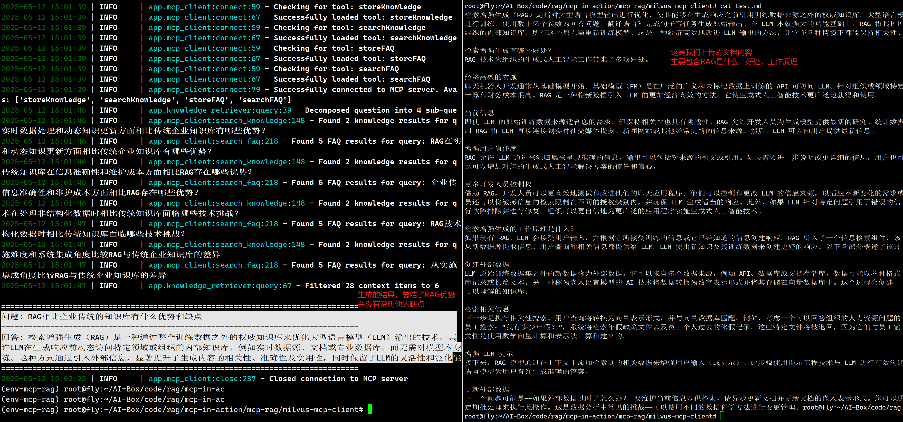

# Milvus MCP Client

基于 Milvus 向量数据库的 MCP（模型上下文协议）客户端的 Python 实现。

## 功能概述

Milvus MCP Client 提供了与 Milvus MCP Server 交互的客户端能力，通过 MCP 协议与大模型进行交互，实现以下功能：

1. **知识库构建**：
   - 文本切段：对长文本进行切段，保证文本完整性和语义完整性
   - 提取 FAQ：根据文本内容自动提取 FAQ
   - 导入知识库：将文本和 FAQ 导入到 Milvus 向量数据库中

2. **知识检索（RAG）**：
   - 问题拆解：对用户问题进行拆解和重写，拆解为更原子的子问题
   - 检索：对每个子问题分别检索相关文本和 FAQ
   - 知识库内容筛选：筛选检索内容，保留最相关的内容进行回答

## 环境要求

- Python 3.10+
- 已部署并启动的 Milvus MCP Server

## 安装与配置

1. 克隆项目并进入目录：
```bash
cd milvus-mcp-client
```

2. 安装依赖：
```bash
pip install -r requirements.txt
```

3. 配置环境变量：
复制`.env.example`来创建 `.env` 文件并添加以下配置：
```
# MCP服务器配置
MCP_SERVER_URL=http://localhost:8080/sse

# LLM API配置
OPENAI_API_KEY=your_openai_api_key
OPENAI_API_BASE=your_openai_api_base_url  # 可选，适用于自建API服务
OPENAI_MODEL=qwen3-32b # 或其他通过OpenAI API访问的Qwen模型名称

# 日志级别
LOG_LEVEL=INFO
```

## 使用方式

### 运行示例

#### 查看帮助命令
```bash
# 查看帮助命令
python -m app.main help

================================================================================
Milvus MCP Client 使用指南
================================================================================

构建知识库:
--------------------------------------------------------------------------------
从文件构建知识库:
  python -m app.main build --file <文件路径>

从文件构建知识库并设置元数据:
  python -m app.main build --file <文件路径> --title "文档标题" --author "作者" --tags "标签1,标签2"

使用自定义分块大小:
  python -m app.main build --file <文件路径> --chunk-size 2000 --chunk-overlap 400

从文本构建知识库:
  python -m app.main build --text "这是要处理的文本内容" --title "内容标题"

不提取FAQ:
  python -m app.main build --file <文件路径> --no-faq

查询知识库:
--------------------------------------------------------------------------------
基本查询:
  python -m app.main query --question "您的问题"

指定最大结果数:
  python -m app.main query --question "您的问题" --max-results 10

```

#### 构建知识库
```bash
(venv_mcp_rag) root@fly:~/AI-Box/code/rag/mcp-in-action/mcp-rag/milvus-mcp-client#  python -m app.main build --file test.md --title "RAG基本介绍" --author "萤火AI百宝箱" --tags "LLM,RAG,知识库"
2025-05-12 14:50:15 | INFO     | app.mcp_client:__init__:25 - Initialized MCP client with server URL: http://localhost:8080/sse
2025-05-12 14:50:16 | INFO     | app.llm_client:__init__:33 - Initialized LLM client with model: qwen3-32b
2025-05-12 14:50:16 | INFO     | app.knowledge_builder:__init__:28 - Initialized KnowledgeBuilder with chunk_size=1000, chunk_overlap=200
2025-05-12 14:50:16 | INFO     | __main__:build_knowledge_base:30 - Building knowledge base from file: test.md
2025-05-12 14:50:16 | INFO     | app.mcp_client:connect:40 - Connecting to MCP server at http://localhost:8080/sse...
2025-05-12 14:50:16 | INFO     | app.mcp_client:connect:59 - Checking for tool: storeKnowledge
2025-05-12 14:50:16 | INFO     | app.mcp_client:connect:67 - Successfully loaded tool: storeKnowledge
2025-05-12 14:50:16 | INFO     | app.mcp_client:connect:59 - Checking for tool: searchKnowledge
2025-05-12 14:50:16 | INFO     | app.mcp_client:connect:67 - Successfully loaded tool: searchKnowledge
2025-05-12 14:50:16 | INFO     | app.mcp_client:connect:59 - Checking for tool: storeFAQ
2025-05-12 14:50:16 | INFO     | app.mcp_client:connect:67 - Successfully loaded tool: storeFAQ
2025-05-12 14:50:16 | INFO     | app.mcp_client:connect:59 - Checking for tool: searchFAQ
2025-05-12 14:50:16 | INFO     | app.mcp_client:connect:67 - Successfully loaded tool: searchFAQ
2025-05-12 14:50:16 | INFO     | app.mcp_client:connect:79 - Successfully connected to MCP server. Available tools: ['storeKnowledge', 'searchKnowledge', 'storeFAQ', 'searchFAQ']
2025-05-12 14:50:16 | INFO     | app.knowledge_builder:build_from_text:52 - Split text into 2 chunks
2025-05-12 14:50:16 | INFO     | app.mcp_client:store_knowledge:105 - Successfully stored knowledge content
2025-05-12 14:50:17 | INFO     | app.mcp_client:store_knowledge:105 - Successfully stored knowledge content
2025-05-12 14:50:59 | INFO     | app.knowledge_builder:build_from_text:72 - Extracted 8 FAQs from text
2025-05-12 14:50:59 | INFO     | app.mcp_client:store_faq:175 - Successfully stored FAQ content
2025-05-12 14:50:59 | INFO     | app.mcp_client:store_faq:175 - Successfully stored FAQ content
2025-05-12 14:50:59 | INFO     | app.mcp_client:store_faq:175 - Successfully stored FAQ content
2025-05-12 14:50:59 | INFO     | app.mcp_client:store_faq:175 - Successfully stored FAQ content
2025-05-12 14:51:00 | INFO     | app.mcp_client:store_faq:175 - Successfully stored FAQ content
2025-05-12 14:51:00 | INFO     | app.mcp_client:store_faq:175 - Successfully stored FAQ content
2025-05-12 14:51:00 | INFO     | app.mcp_client:store_faq:175 - Successfully stored FAQ content
2025-05-12 14:51:00 | INFO     | app.mcp_client:store_faq:175 - Successfully stored FAQ content
2025-05-12 14:51:00 | INFO     | __main__:build_knowledge_base:48 - Stored 2/2 chunks to knowledge base
2025-05-12 14:51:00 | INFO     | __main__:build_knowledge_base:50 - Extracted and stored 8 FAQs
2025-05-12 14:51:00 | INFO     | app.mcp_client:close:237 - Closed connection to MCP server
```
运行效果


#### 查询知识库
```bash
(venv_mcp_rag) root@fly:~/AI-Box/code/rag/mcp-in-action/mcp-rag/milvus-mcp-client# python -m app.main query --question "RAG相比企业传统的知识库有什么优势和缺点"
2025-05-12 15:01:38 | INFO     | app.mcp_client:__init__:25 - Initialized MCP client with server URL: http://localhost:8080/sse
2025-05-12 15:01:39 | INFO     | app.llm_client:__init__:33 - Initialized LLM client with model: qwen3-32b
2025-05-12 15:01:39 | INFO     | app.knowledge_retriever:__init__:22 - Initialized KnowledgeRetriever with max_search_results=5
2025-05-12 15:01:39 | INFO     | __main__:query_knowledge_base:71 - Querying knowledge base with question: RAG相比企业传统的知识库有什么优势和缺点
2025-05-12 15:01:39 | INFO     | app.mcp_client:connect:40 - Connecting to MCP server at http://localhost:8080/sse...
2025-05-12 15:01:39 | INFO     | app.mcp_client:connect:59 - Checking for tool: storeKnowledge
2025-05-12 15:01:39 | INFO     | app.mcp_client:connect:67 - Successfully loaded tool: storeKnowledge
2025-05-12 15:01:39 | INFO     | app.mcp_client:connect:59 - Checking for tool: searchKnowledge
2025-05-12 15:01:39 | INFO     | app.mcp_client:connect:67 - Successfully loaded tool: searchKnowledge
2025-05-12 15:01:39 | INFO     | app.mcp_client:connect:59 - Checking for tool: storeFAQ
2025-05-12 15:01:39 | INFO     | app.mcp_client:connect:67 - Successfully loaded tool: storeFAQ
2025-05-12 15:01:39 | INFO     | app.mcp_client:connect:59 - Checking for tool: searchFAQ
2025-05-12 15:01:39 | INFO     | app.mcp_client:connect:67 - Successfully loaded tool: searchFAQ
2025-05-12 15:01:39 | INFO     | app.mcp_client:connect:79 - Successfully connected to MCP server. Available tools: ['storeKnowledge', 'searchKnowledge', 'storeFAQ', 'searchFAQ']
2025-05-12 15:01:46 | INFO     | app.knowledge_retriever:query:39 - Decomposed question into 4 sub-questions
2025-05-12 15:01:46 | INFO     | app.mcp_client:search_knowledge:148 - Found 2 knowledge results for query: RAG在实时数据处理和动态知识更新方面相比传统企业知识库有哪些优势？
2025-05-12 15:01:46 | INFO     | app.mcp_client:search_faq:218 - Found 5 FAQ results for query: RAG在实时数据处理和动态知识更新方面相比传统企业知识库有哪些优势？
2025-05-12 15:01:46 | INFO     | app.mcp_client:search_knowledge:148 - Found 2 knowledge results for query: 企业传统知识库在信息准确性和维护成本方面相比RAG存在哪些优势？
2025-05-12 15:01:46 | INFO     | app.mcp_client:search_faq:218 - Found 5 FAQ results for query: 企业传统知识库在信息准确性和维护成本方面相比RAG存在哪些优势？
2025-05-12 15:01:46 | INFO     | app.mcp_client:search_knowledge:148 - Found 2 knowledge results for query: RAG技术在处理非结构化数据时相比传统知识库面临哪些技术挑战？
2025-05-12 15:01:47 | INFO     | app.mcp_client:search_faq:218 - Found 5 FAQ results for query: RAG技术在处理非结构化数据时相比传统知识库面临哪些技术挑战？
2025-05-12 15:01:47 | INFO     | app.mcp_client:search_knowledge:148 - Found 2 knowledge results for query: 从实施难度和系统集成角度比较RAG与传统企业知识库的差异
2025-05-12 15:01:47 | INFO     | app.mcp_client:search_faq:218 - Found 5 FAQ results for query: 从实施难度和系统集成角度比较RAG与传统企业知识库的差异
2025-05-12 15:01:47 | INFO     | app.knowledge_retriever:query:67 - Filtered 28 context items to 6

================================================================================
问题: RAG相比企业传统的知识库有什么优势和缺点
--------------------------------------------------------------------------------
回答: 检索增强生成（RAG）是一种通过整合训练数据之外的权威知识库来优化大型语言模型（LLM）输出的技术。其核心在于允许LLM在生成响应前动态访问特定领域或组织的内部知识库，例如实时数据源、文档或专业数据库，而无需对模型本身进行重新训练。这种方式通过引入外部信息，显著提升了生成内容的相关性、准确性及实用性，同时保留了LLM的灵活性和泛化能力。
================================================================================
2025-05-12 15:02:25 | INFO     | app.mcp_client:close:237 - Closed connection to MCP server
```
> 
运行效果

> 生成的结果，总结了RAG优势,并没有说明他的缺点

## API参考

### 知识库构建
```python
from app.knowledge_builder import KnowledgeBuilder

# 初始化知识库构建器
builder = KnowledgeBuilder()

# 从文件构建知识库
builder.build_from_file("path/to/your/document.txt")

# 从文本构建知识库
builder.build_from_text("您的文本内容")
```

### 知识检索与问答
```python
from app.knowledge_retriever import KnowledgeRetriever

# 初始化知识检索器
retriever = KnowledgeRetriever()

# 提问并获取回答
answer = retriever.query("您的问题")
print(answer)
```

## 与Milvus MCP Server的集成

本客户端通过 MCP 协议与 Milvus MCP Server 进行通信，使用 Server 提供的以下工具：

1. `storeKnowledge`: 存储文本到知识库
2. `searchKnowledge`: 在知识库中搜索相似文档
3. `storeFAQ`: 存储FAQ到FAQ库
4. `searchFAQ`: 在FAQ库中搜索相似问答对

## 许可证

MIT License 

## 参考文档
1. milvus 可视化客户端--Attu桌面快速入门：https://milvus.io/docs/zh/quickstart_with_attu.md